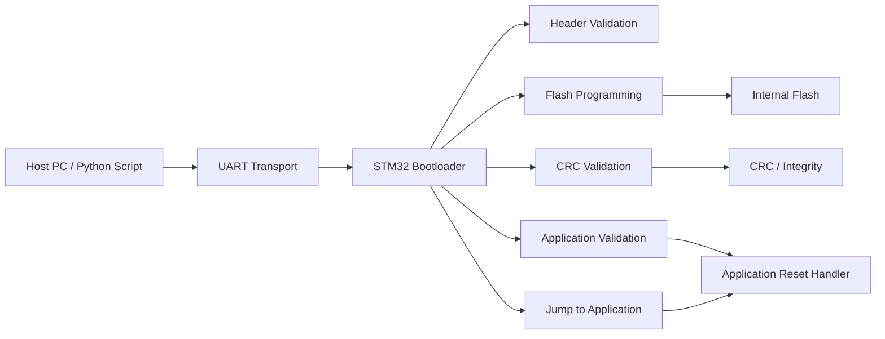
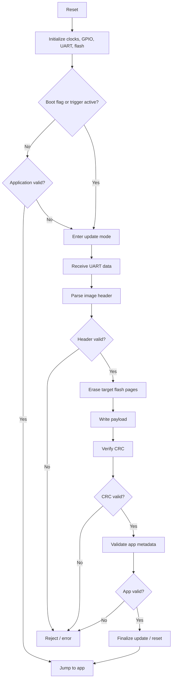

# STM32 UART Bootloader

A minimal bare-metal bootloader for the STM32F407 that receives firmware images over UART, validates them, programs internal Flash, verifies integrity, and transfers execution to the application.

The project was developed using direct register-level programming with the STM32 peripheral registers and was debugged at the instruction/register level using GDB and Renode..

---

## System overview



---

## Boot flow


---

## Memory map

This is the expected conceptual layout for an STM32F407 bootloader project.

```text

Flash  


0x08000000  +---------------------------+  Start of flash
            | Bootloader                |
            |                           |
0x08008000  |---------------------------|
            |                           |
            |     Application slo t     |
            |                           |
            |---------------------------|
            | metadata / flag           |
            |                           |
0x08080000  +---------------------------+  End of flash 

```

---

## Firmware image format

The bootloader expects a custom image format in this order:

```text
+-------------------------------------------------------------+
| Header        | 12 bytes                                    |
+-------------------------------------------------------------+
| Payload       | N bytes                                     |
+-------------------------------------------------------------+
| CRC32         | 4 bytes   (CRC of the header and payload)   |
+-------------------------------------------------------------+
```

This lets the bootloader:
- reject malformed packets,
- ensure the image fits in flash,
- validate the firmware before writing,
- and skip invalid programs

---

## Bootloader responsibilities

### 1. Boot decision
The bootloader decides whether to:
- jump directly to the current program,
- or wait for an update,
- or accept an update after a trigger event.

### 2. UART receive
The UART path receives a firmware image from the host. The code tracks:
- bytes received,
- packet boundary,
- header parsing state,
- payload length,
- and final CRC verification.

### 3. Flash writing
The flash writer:
- unlocks the flash controller,
- erases the application area,
- writes the payload,
- waits for flash completion,
- and verifies the write.

### 4. CRC check
The bootloader calculates a CRC over the received payload and compares it against the expected value.

### 5. App validation
Before jumping, the code checks:
- stack pointer is valid,
- reset handler address is in flash,
- vector table is sane,
- and the app is not blank or invalid.

### 6. Jump routine
The jump routine loads:
- the app stack pointer from the vector table,
- the reset handler address,
- disables interrupts,
- sets the main stack pointer,
- and branches to the application.

---

## UART Reception
UART reception was implemented initially using the STM32 USART peripheral and DMA.

During development, I also implemented an interrupt-driven receive path to isolate the UART functionality from the DMA subsystem.

The interrupt-driven path maintains:

```c
static uint8_t rxBuffer[RX_BUFFER_SIZE];

static volatile uint16_t rxPos;
static volatile uint16_t rxLength;
static volatile uint8_t rxReady;
```

Received bytes are appended to the buffer:

```c
void USART1_RX_Byte(uint8_t byte)
{
    if (rxPos < RX_BUFFER_SIZE)
    {
        rxBuffer[rxPos++] = byte;
    }
}
```

An USART IDLE event is then used to identify the end of a received burst:

```c
if (sr & USART_SR_IDLE)
{
    rxData = rxBuffer;
    rxLength = rxPos;
    rxPos = 0;

    rxReady = 1;
}
```

This separation was useful during debugging because it allowed the UART receive mechanism and the DMA mechanism to be evaluated independently.

---

## Low-Level Debugging

A significant part of the project involved debugging the system at the register and instruction level.

The firmware was compiled with debug symbols and connected to the Renode GDB server:

```text
  gdb-multiarch 
        │
        ▼
  bootloader.elf
        │
        ▼
     Renode
        │
        ▼
   GDB :3333
```

Example debugging session:

```shell
(gdb) break USART1_IRQHandler
(gdb) continue

Breakpoint, USART1_IRQHandler ()

(gdb) p rxPos
$1 = 0

(gdb) x/8bx rxBuffer
0x20000850:
0x43 0x00 0x00 0x00 0x00 0x00 0x00 0x00
```

After stepping through the receive handler:

```shell
(gdb) next
(gdb) p rxPos
$2 = 1

(gdb) x/8bx rxBuffer
0x20000850:
0x41 0x00 0x00 0x00 0x00 0x00 0x00 0x00
```

This confirmed that incoming UART data was being read from the USART data register and correctly stored in RAM.

The update-processing stage was also reached with the expected data:

```shell
Breakpoint, UpdateProcess
(data=0x20000154 <rxByte> "A", length=1)
```

This provided a useful end-to-end verification of the UART → interrupt → RAM → update-processing path.

---

## DMA Investigation

The project originally used:

```text
USART1
   │
   │ RX
   ▼
DMA2 Stream 2
   │
   ▼
RAM receive buffer
```

The relevant STM32 configuration uses DMA2 Stream 2, Channel 4.

During testing under Renode, the simulator repeatedly reported warnings such as:

```shell
dma2: Unhandled write to offset 0x8
dma2: Unhandled write to offset 0x40

Unhandled bits:
[16, 18-20]
[8, 17, 27]
```
These correspond to DMA interrupt-flag and stream-control fields such as:
- CFEIF2
- CDMEIF2
- CTEIF2
- CHTIF2
- CIRC
- PL

The DMA registers were therefore inspected directly using GDB, for example:

```shell
(gdb) x/wx 0x40020440
(gdb) x/wx 0x40020408
(gdb) x/32bx rxBuffer
```

The investigation established that the firmware was reaching and configuring the DMA subsystem, but the Renode peripheral model did not provide sufficient evidence to conclusively validate the complete DMA receive path.

Rather than treating the simulator warning as proof of a firmware defect, I isolated the UART reception path using interrupts. This allowed the remainder of the bootloader to be tested independently.

This was an important debugging outcome: The DMA-based UART receive path could not be conclusively validated under the current Renode configuration. Register-level investigation showed that the firmware reached and configured the DMA subsystem, but simulator warnings around DMA stream configuration and interrupt/status fields prevented the complete receive path from being verified. The interrupt-driven UART implementation was therefore used as an independent validation path for the remainder of the bootloader. Validation of DMA reception on physical STM32F407 hardware remains future work.

---

## Flash Programming
Once an image passes the required validation stages, the bootloader programs it into the application region.

The Flash programming process consists of:

- Unlock Flash controller
- Erase application sectors/pages
- Program firmware data
- Wait for completion
- Verify programmed contents
- Calculate/verify CRC
- Validate application vector table
- Transfer execution

---

## Application Validation
Before executing an application, the bootloader verifies that the vector table contains plausible values.

The application reset sequence is based on the Cortex-M vector table:

```text
Application Base
      │
      ├── +0x00  Initial MSP
      │
      └── +0x04  Reset Handler

```
The bootloader uses these values to determine whether an application is present and whether its reset handler points into an appropriate executable region.

This prevents blindly jumping to an erased or corrupted application.

---

## Jump to Application
After validation, the bootloader transfers control to the application by:

- disabling interrupts
- obtaining the application's initial stack pointer
- obtaining the application's reset handler
- relocating the vector table
- loading the application stack pointer
- branching to the reset handler

Conceptually:

```text
Bootloader
    │
    │ validate application
    ▼
Application Vector Table
    │
    ├── MSP
    │
    └── Reset Handler
             │
             ▼
       Application
```

---

## Build

```bash
make
```

Clean:

```bash
make clean
```

Run the project:

```bash
make run
```

or:

```bash
renode run.resc
```

---


## Testing
The project was tested using:

- gdb-multiarch 
- GDB
- Renode
- a host-side UART test
- direct inspection of STM32 peripheral registers
- memory inspection of UART receive buffers

Example UART test:

```bash
printf 'ABC' | nc 127.0.0.1 1234
```

The receive handler was observed to process the incoming data and update the receive buffer and position counter.

```shell
rxBuffer:
41 42 43 ...

rxPos:
3
```
The application was also successfully executed when the bootloader and application images were loaded together.

---

## Current Status

### Verified
 - [X] Bootloader builds successfully
 - [X] Application builds successfully
 - [X] Bootloader/application memory separation
 - [X] UART initialization
 - [X] UART transmission
 - [X] UART interrupt reception
 - [X] Data successfully reaches RAM
 - [X] Receive position tracking
 - [X] IDLE-line based frame detection
 - [x] Update-processing path
 - [x] Firmware image validation
 - [x] Flash programming
 - [x] CRC verification
 - [x] Application validation
 - [x] Application execution
 - [x] Register-level debugging with GDB

 #### Under Investigation
 - [ ] Full DMA-based UART reception under Renode

The remaining DMA issue is specifically associated with the simulator's DMA peripheral model. The interrupt-driven UART path was used to isolate and verify the rest of the update mechanism.

---

## What I Learned
This project provided practical experience with several areas of embedded systems development:

Bare-metal peripheral programming
Rather than relying on a HAL, the peripherals were configured through STM32 registers, including:

- RCC
- GPIO
- USART
- DMA
- Flash controller
- NVIC

### Firmware architecture

The project required separating:

```text
Boot decision
      ↓
Communication
      ↓
Image validation
      ↓
Flash programming
      ↓
Integrity verification
      ↓
Application validation
      ↓
Application execution
```

### Embedded debugging
A major part of the development process involved moving beyond source-level debugging and inspecting:

- peripheral registers
- memory addresses
- interrupt execution
- DMA state
- receive buffers
- stack/vector-table state

### Debugging methodology
One of the most useful lessons was learning to isolate faults instead of assuming that a failure in one subsystem means the entire system is broken.

For example, when DMA reception could not be conclusively validated in Renode, I replaced the DMA receive path temporarily with interrupt-driven reception. This allowed me to verify that UART reception, buffering, update processing, Flash programming, and application execution were functioning independently of the DMA model.

---

## Project Status
The project demonstrates a complete STM32 bootloader architecture capable of receiving, validating, programming, and executing application firmware.

The UART interrupt-based receive path has been verified under the development environment, including direct observation of received bytes entering RAM and reaching the update-processing layer.

The remaining limitation is full end-to-end validation of the DMA-based UART receive implementation under Renode. The simulator reports unsupported DMA register fields during configuration, preventing the DMA path from being conclusively validated in emulation.

Validation of the DMA path on physical STM32F407 hardware would be the natural next step.

---

## Build

```bash
make
```

Run the Renode environment:

```bash
make run
```

Clean the project:

```bash
make clean
```

---

## Technologies

### Microcontroller

- STM32F407
- ARM Cortex-M4

### Languages

- C
- ARM assembly where required by the startup/jump code

### Development tools

- GCC ARM Embedded
- GDB
- Renode
- Make

### Concepts

- Bare-metal programming
- Memory-mapped peripherals
- UART/USART
- Interrupts
- DMA
- Flash programming
- CRC
- Vector tables
- Bootloaders
- Firmware update protocols
- Embedded debugging

---

## License

See the `LICENSE` file for details.
